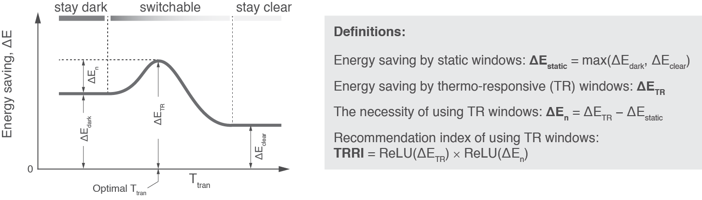

# PyDynamicWindow

This module provides an open-source tool to optimize the intrinsic properties of thermo-responsive (TR) dynamic windows and evaluate their energy performance in building windows on a global scale. TR dynamic windows can be realized by incorporating a layer of thermochromic (TC) material into the window glazing or by integrating temperature sensors with electrochromic (EC) windows. Regaring building energy saving, three key parameters of TR windows include:
1. dark-state solar transmittance ($\tau_{dark}$), 
2. dark-state solar transmittance ($\tau_{clear}$), and 
3. transition temperature ($T_{tran}$).

Three indicators are used to evaluate TR windows:
1. Energy saving ($\Delta E_{TR}$)
2. Necessity level ($\Delta E_{n}$)
3. TR recommendation index (TRRI)

This tool can be used mainly in two scenarios:
1. Optimize $T_{tran}$ by given $\tau_{dark}$ and $\tau_{clear}$, and evaluate energy performance (Example 01)
2. Evaluate energy performance by given $\tau_{dark}$, $\tau_{clear}$, and $T_{tran}$ (Example 02)

The artificial neural network models are trained by EnergyPlus simulation results using weather files of over two thousand global locations. The EnergyPlus model is adapted from Department of Energy's (DOE's) prototype building model for a medium-size office building. Technical details can be found in a coming publication.

...

Contact

Yuan Gao - y.gao@lbl.gov

